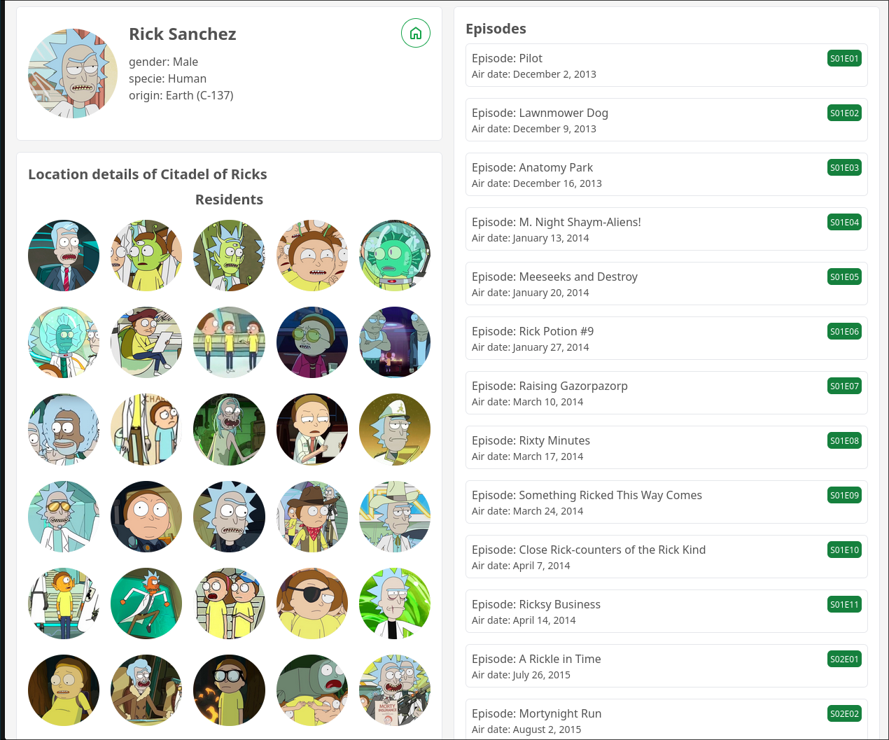

# Svelte-vs-Next-js

    
    
    

 

 

- This project was created to show the same application in two different frameworks on typescript and see the differences in numbers. 

- The `svelte` version is already done, you can check this out <a target='_blank' href='https://rickandmortysvelte.vercel.app/'>here</a>

<h3>Svelte application details</h3>

| Attributes               | unit     |
|--------------------------|----------|
| memory RAM (development) | 216mb    |
| build time               | 4.25 sec |
| build cache              | 23mb     |

 

    

